# Rock Paper Scissors Lizard Spock

Rock Paper Scissors Lizard Spock is a variant of the game Rock Paper Scissors, created by the charactor Sheldon in the big bang theory. This game is a good way to showcase the javascript by providing a website which requires user input and outputs data based on the user input. Creating a simple but fun game for anyone to enjoy.

[You can access the project here](https://rsrbai.github.io/portfolio2/)

# Rules of the game

The player makes a pick of their choice of rock, paper, scissors, lizard or spock. The computer then generates a random choice and these choices are compared to see who the winner is. The winners score is incremented by 1, if it is a tie (both player and computer and the same choice) scores do not get incremented.

* The following rules apply:
    - Scissors cuts paper 
    - Paper covers rock
    - Rock crushes lizard
    - Lizard poisons Spock
    - Spock smashes scissors
    - Scissors decapitates lizard
    - Lizard eats paper
    - Paper disproves Spock
    - Spock vaporizes rock
    - Rock crushes scissors

# Features

## Existing Features

* User and comp name tags
* Score keeper for player and comp
* Action message prompting an action
* 5 buttons (one for each of rock, paper, scissors, lizard, spock)
* A user image representing the users choice
* A comp image representing the comps choice
* A results message reinforcing the outcome

## Future Features

* Giving the user the option to have a best out of 3 or 5 games.
* A Timer to see how many games you can win in a certain amount of time.
* Customizable name

# Testing

## Manual testing

* Test that the correct alert appears for the user clicking rock

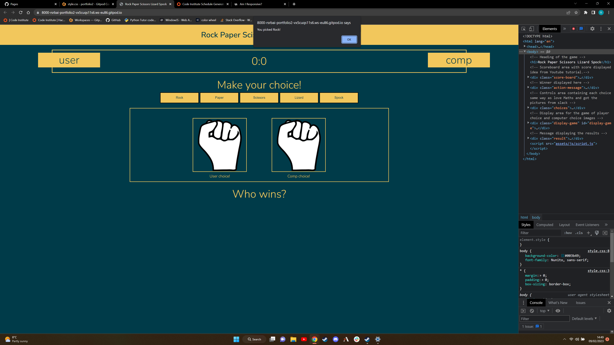

* Test that the rock choice registered and processed correctly

* Test that the correct alert appears for the user clicking paper

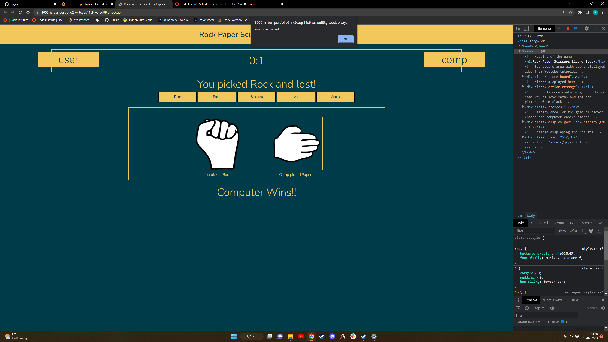

* Test that the paper choice registered and processed correctly

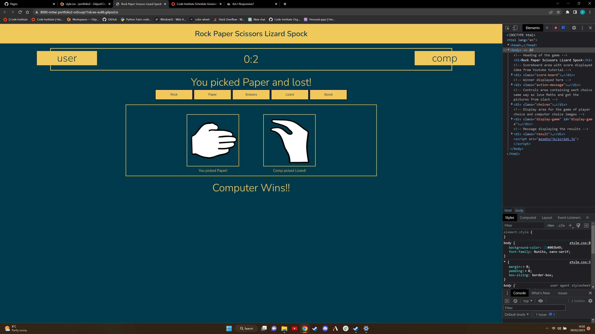

* Test that the correct alert appears for the user clicking scissors

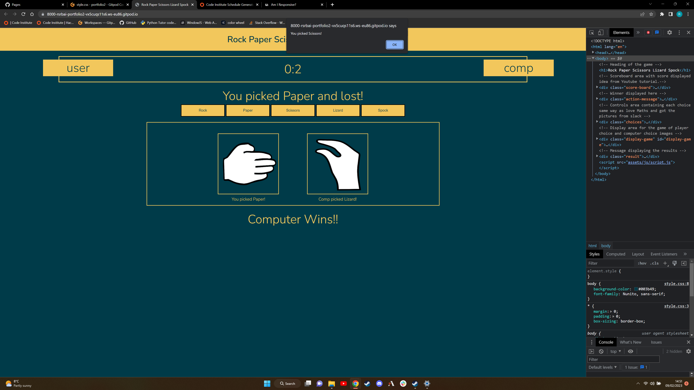

* Test that the scissors choice registered and processed correctly

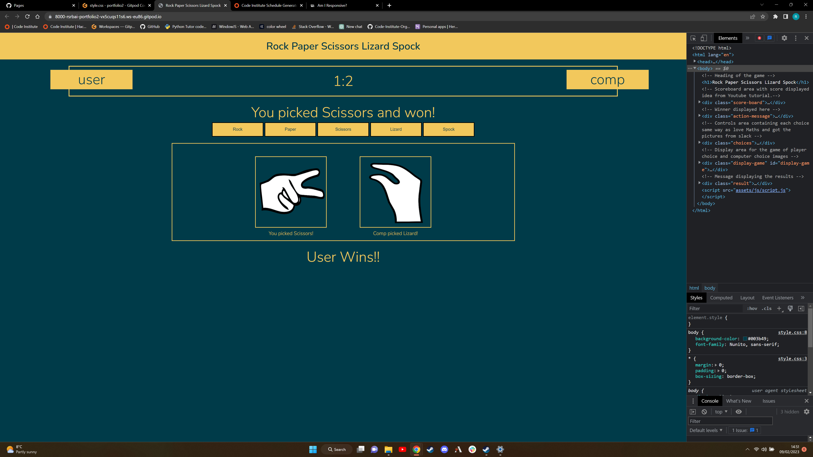

* Test that the correct alert appears for the user clicking lizard

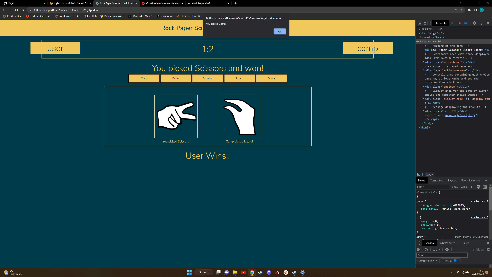

* Test that the lizard choice registered and processed correctly

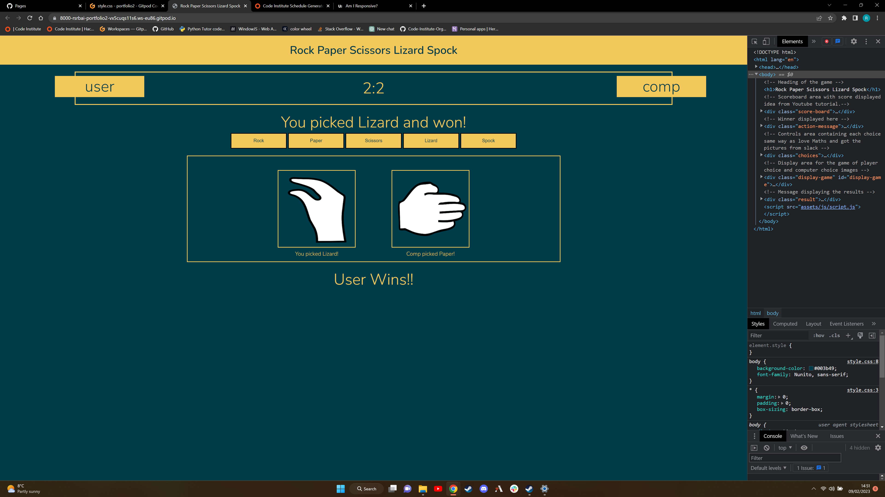

* Test that the correct alert appears for the user clicking Spock

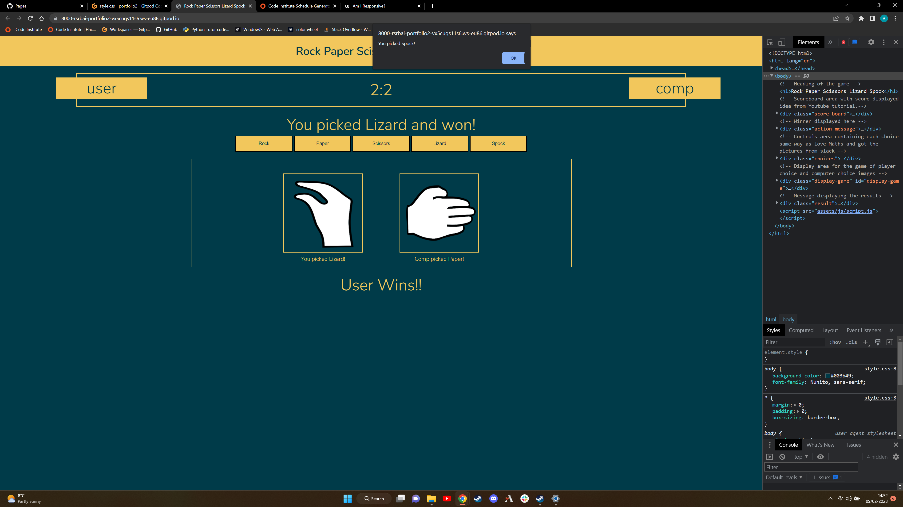

* Test that the Spock choice registered and processed correctly

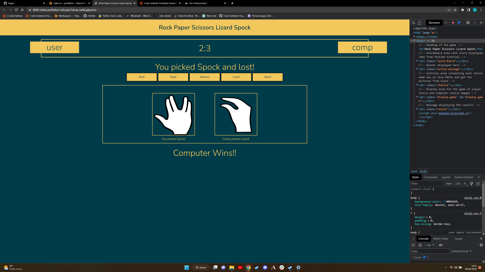

## HTML Validator

In the image below I have two bugs being shown, both duplicate ids in the code.

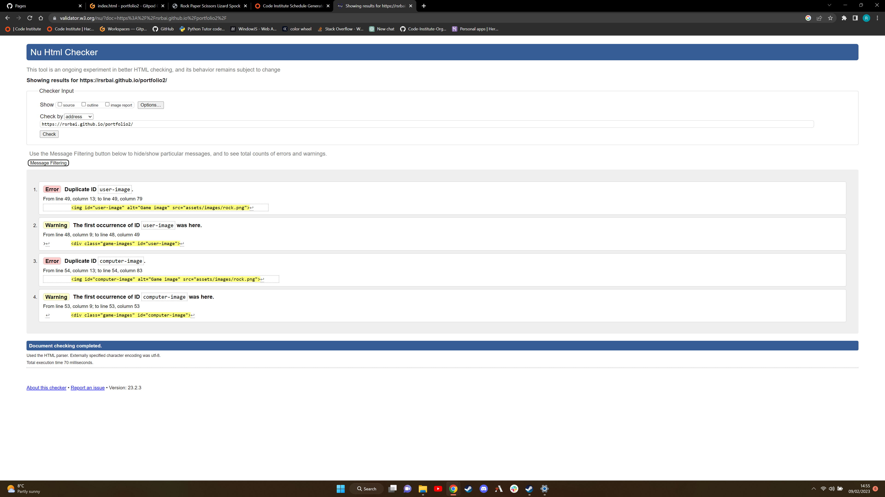

To fix this I added div to each element that had the duplicate ID giving more specifity. I then passed my code back through the HTML validator and received no errors or warnings as you can see in the image below.

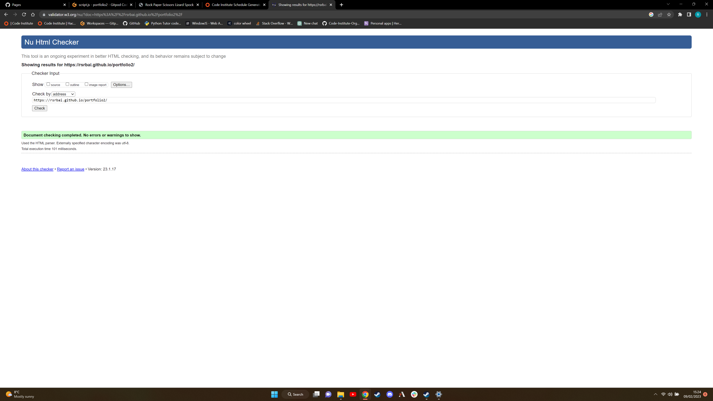

