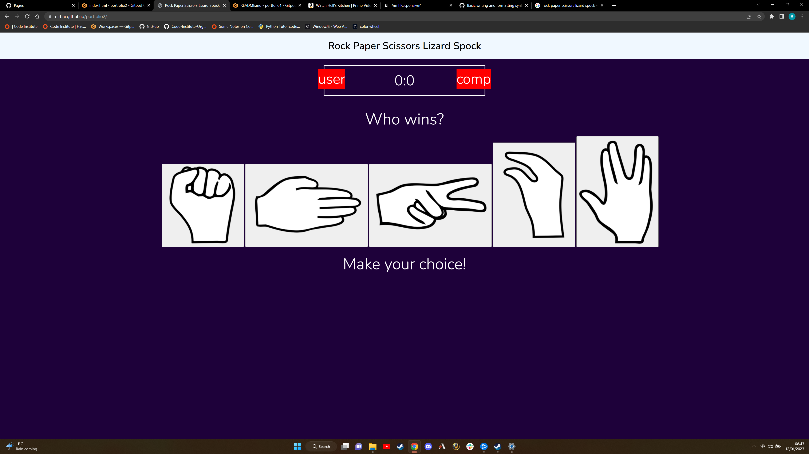
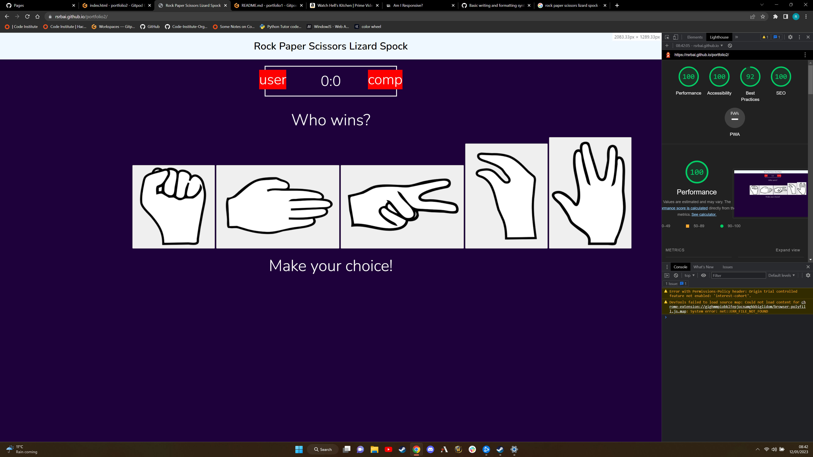
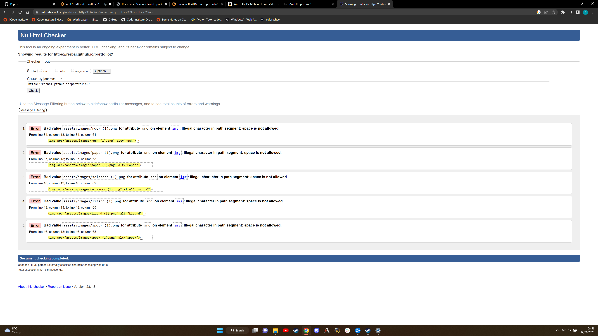
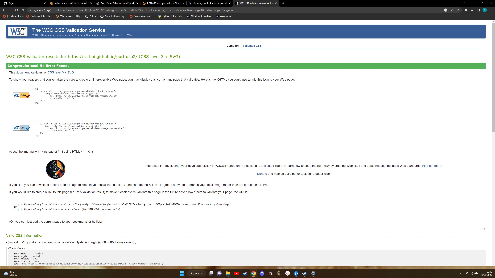
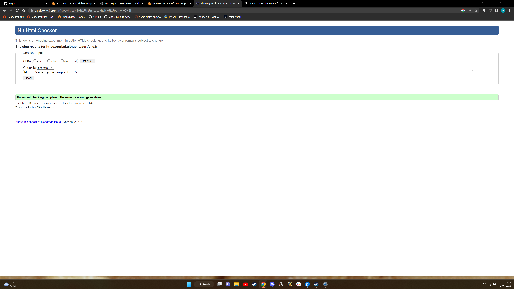
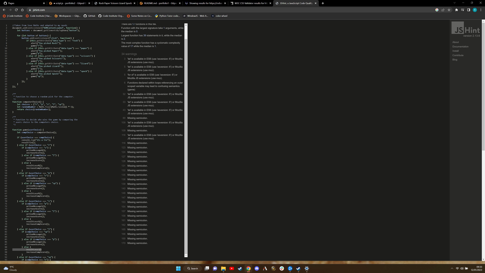

# Rock Paper Scissors Lizard Spock

Rock Paper Scissors Lizard Spock is a variant of the game Rock Paper Scissors, created by the charactor Sheldon in the big bang theory. The following rules apply: "Scissors decapitate Scissors cuts paper, paper covers rock, rock crushes lizard, lizard poisons Spock, Spock smashes scissors, scissors decapitates lizard, lizard eats paper, paper disproves Spock, Spock vaporizes rock, and as it always has, rock crushes scissors.". This game is a good way to showcase the javascript by providing a website which requires user input and outputs data based on the user input. Creating a simple but fun game for anyone to enjoy.

.png)

## Main game page

We have a very simple layout with a simple scoreboard for the user and computer, a simple clear title and 5 buttons to select. There are also two areas for communication, was purely for the winner and below the button informs the user of the actions hey have taken

There are 5 buttons with the images of rock, paper, scissors, lizard, spock. 

## Testing

All bugs found fixed by removing the space in the image name and doing the same for each img link in html.

I also forgot to remove a space from the image file name while correcting the previous bug, causing another bug in that the scissors image was not loading. I removed the space from the scissors image file to fix this.

Using JShint highlighted quite a few errors and warnings, most of them were missing ; from code through 100-170. The other warnings were rectified by adding jshint file and use 'esversion: 6'.
## Deployment

I deployed the page using Github by opening the repository and selecting settings I then selected pages on the left hand side and within that selected the main branh and clicked save, the page then is loaded and published.

[Click here to go to the published website](https://rsrbai.github.io/portfolio2/)

## Credits

I took alot of inspiration for the design of the project and the idea for the scoreboard etc as i thought it was clean and easy to do.

[click here to go to the youtube tutorial](https://www.youtube.com/watch?v=jaVNP3nIAv0&t=350s&ab_channel=freeCodeCamp.org)

the youtubers own channel is here  
[click here to go to whatdevs youtube channel](https://www.youtube.com/channel/UC0tRdbXVDbhaRvZPKsRgmxg)
