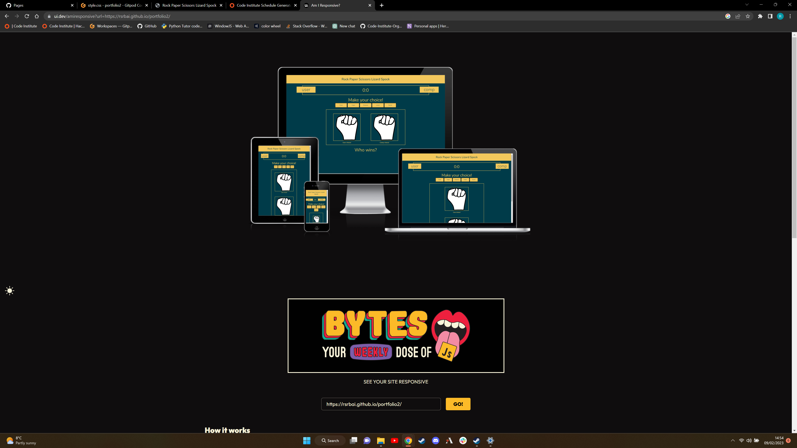

# Rock Paper Scissors Lizard Spock

Rock Paper Scissors Lizard Spock is a variant of the game Rock Paper Scissors, created by the charactor Sheldon in the big bang theory. This game is a good way to showcase the javascript by providing a website which requires user input and outputs data based on the user input. Creating a simple but fun game for anyone to enjoy. The games scope includes anyone who would like to try their luck against the computer.

[You can access the project here](https://rsrbai.github.io/portfolio2/)

# Rules of the game

The player makes a pick of their choice of rock, paper, scissors, lizard or spock. The computer then generates a random choice and these choices are compared to see who the winner is. The winners score is incremented by 1, if it is a tie (both player and computer and the same choice) scores do not get incremented.

* The following rules apply:
    - Scissors cuts paper 
    - Paper covers rock
    - Rock crushes lizard
    - Lizard poisons Spock
    - Spock smashes scissors
    - Scissors decapitates lizard
    - Lizard eats paper
    - Paper disproves Spock
    - Spock vaporizes rock
    - Rock crushes scissors

# Features

## Existing Features

* Favicon of a missile being launched to represent attacks
* User and comp name tags
* Score keeper for player and comp
* Action message prompting an action
* 5 buttons (one for each of rock, paper, scissors, lizard, spock)
* A user image representing the users choice
* A comp image representing the comps choice
* A results message reinforcing the outcome

## Future Features

* Giving the user the option to have a best out of 3 or 5 games.
* A Timer to see how many games you can win in a certain amount of time.
* Customizable name

# Testing

## Manual testing

* Test that the correct alert appears for the user clicking rock

* Test that the rock choice registered and processed correctly

* Test that the correct alert appears for the user clicking paper

* Test that the paper choice registered and processed correctly

* Test that the correct alert appears for the user clicking scissors

* Test that the scissors choice registered and processed correctly

* Test that the correct alert appears for the user clicking lizard

* Test that the lizard choice registered and processed correctly

* Test that the correct alert appears for the user clicking Spock

* Test that the Spock choice registered and processed correctly

## HTML Validator

In the image below I have two bugs being shown, both duplicate ids in the code.

To fix this I added div to each element that had the duplicate ID giving more specifity. I then passed my code back through the HTML validator and received no errors or warnings as you can see in the image below.

## CSS Validator 

In the image below I have one bug flagged by the W3C CSS validator, this is due to no - in the css rule.

To fix this I added the - and passed my code through the validator again and received no errors as shown below

## JS Hint 

As you can see in the image below I have not added the semi-colon to the end of many of the lines of code.

I added the semi-colons where needed and passed my code through the js linter again and received only the warnings about functions in loops as you can see in the picture below.

## Lighthouse test

Below is a successful lighthouse test carried out in chrome developer tools.

## Responsivsness test

Below is a picture of the website displayed on a mobile device sized window.

Below is a picture of the website displayed on a tablet sized window.

Below is a picture of the website displayed on a desktop sized window.

## Web Accessability Evaluation tool

Below I have reveived no errors for accessability from the online Wave (web accessability evaluation tool)

## Bug

Below is a bug I encountered after passing my code through the HTML linter and correcting the duplicate ID bug, the images are no longer changing when they should.

To fix this I correct I changed all of the Javascript code that interacts with the changed html element ID to the correct tag name as seen below.

## Remaining bugs

There are no known remaining bugs

# Deployment

* This website was deployed to GitHub pages, the steps to deploy are as follows:
    - In the GitHub repository navigate to the Settings tab
    - Under code and automation on the left hand side of the Settings tab click on pages
    - Under branch select the branch you would like to deploy
    - Click Save

# Credits

## Design

I got the colour scheme from [this website as seen below](http://www.sussex.ac.uk/tel/resource/tel_website/accessiblecontrast/?q=FFFFFF~003b49~1d4289~94a596~e56db1~d3273e~00bfb2~d6d2c4~ffc845~dc582a~41b6e6~1b365d~be84a3~5d3754~7da1c4~f2c75c~d0d3d4~007a78~000000)

The favicon icon was sourced from [this website](https://icons8.com/icons/set/favicon)

I took ideas [from this tutorial](https://www.youtube.com/watch?v=jaVNP3nIAv0&t=364s&ab_channel=freeCodeCamp.org) on youtube for the overall design and an idea of how the logic would look.

The fonts were taken from Google fonts.

I got the idea to do the game from the Code Institute LMS.

## Media

All of the pictures were sourced from Slack.

